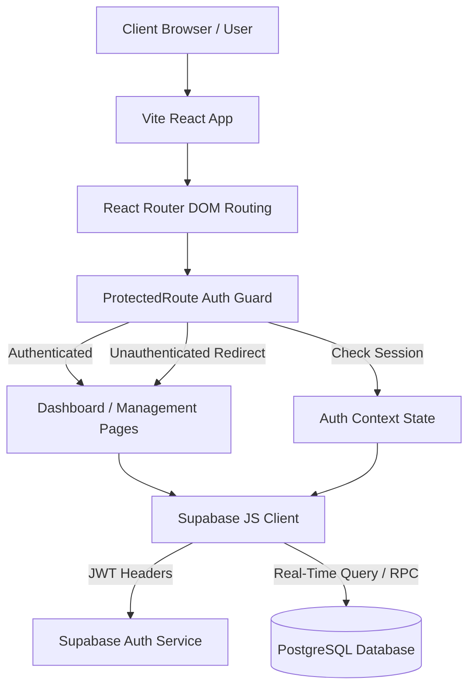
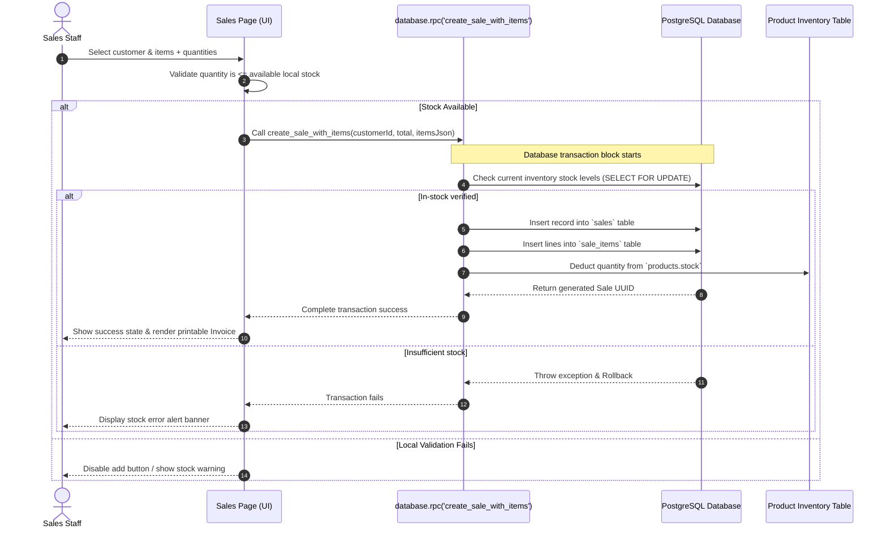

# NexusERP — Enterprise Resource Planning System

NexusERP is a modern, responsive, and robust Mini ERP System designed for secure enterprise inventory control, partner tracking, procurement logging, and transactional sales. It is built using **React (Vite)**, **TypeScript**, **Tailwind CSS**, **Radix UI**, and **Supabase (PostgreSQL)**.

---

## 📊 System Architecture & Workflows

### 1. System Block Diagram


---

### 2. Transaction Flow (Sales & Stock Deduction)


---

## 🛠️ Key Features

- **🔐 Secure Access Control**: Integrated token-based authentication context. Pages are strictly inaccessible without a valid login.
- **📊 Metric Dashboard**: Aggregates all key KPIs (Revenue, Profit, Sales, Product SKU Count, Suppliers, Customers) via optimized asynchronous database reads.
- **📦 Inventory Tracker**: Full CRUD panel for products, with SKU constraints, stock levels, price formats, and low stock warnings.
- **👥 CRM & Supply Network**: Complete profile controls for Customers and Suppliers.
- **ShoppingCart Stock Procurements (Purchases)**: Track incoming stock from suppliers. Processed entries automatically increment inventory values.
- **Receipt Transaction Sales (Sales)**: Handles point-of-sale operations. Uses PostgreSQL transactional locking to check quantities and deduct stock automatically.
- **📄 Printable Invoices**: Modern invoice template layout powered by `react-to-print` for print media or PDF generation.
- **📈 Reports & Analytics**: Provides profit margin calculation, average basket value, inventory valuation summaries, and active alert lists.

---

## 🌐 Routes & Pages Reference

| Route | Access Level | UI Module | Description |
| :--- | :--- | :--- | :--- |
| `/login` | Public | Auth | User login, login verification, error alerts. |
| `/register` | Public | Auth | Register new user account; auto-creates a DB user profile. |
| `/` | **Protected** | Dashboard | Business metrics, low stock warnings, and recent transaction feeds. |
| `/products` | **Protected** | Products CRUD | Full catalog list, product search, filter, creation/edit dialog. |
| `/customers` | **Protected** | Customers CRUD | Customer profile lookup and contact log panel. |
| `/suppliers` | **Protected** | Suppliers CRUD | Supply partner lookup details. |
| `/purchases` | **Protected** | Procurement | Multi-line procurement log; adds quantity directly to stock. |
| `/sales` | **Protected** | Sales Manager | Point-of-sale transaction entry, validation warnings. |
| `/sales/:id/invoice` | **Protected** | Invoices | Clean, receipt invoice printable preview. |
| `/reports` | **Protected** | Analytics | Profit margins, CRM counts, supply chain metrics. |

---

## 📁 Project Directory Structure

```text
NexusERP/
├── .env.example          # Environment variables template
├── .gitignore            # Clean git ignore settings
├── index.html            # Entry markup point
├── postcss.config.js     # PostCSS setup
├── tailwind.config.js    # Tailwind variables & theme overrides
├── tsconfig.json         # TS Compiler setup
├── vite.config.ts        # Vite configuration with React Plugin
├── src/
│   ├── App.tsx           # Global routing definitions
│   ├── main.tsx          # Root DOM renderer
│   ├── index.css         # Styling system & Tailwind layers
│   ├── vite-env.d.ts     # Meta environment typings
│   ├── components/
│   │   ├── DashboardLayout.tsx  # Sidebar navigation UI
│   │   ├── ProtectedRoute.tsx   # Auth Route guard component
│   │   └── ui/
│   │       ├── badge.tsx        # Radix-styled badge
│   │       ├── button.tsx       # Reusable button variant styles
│   │       ├── card.tsx         # Responsive container panels
│   │       ├── dialog.tsx       # Overlay modal container
│   │       ├── input.tsx        # Input fields
│   │       ├── label.tsx        # Structured labels
│   │       ├── select.tsx       # Select dropdown lists
│   │       ├── table.tsx        # Data tables
│   │       └── textarea.tsx     # Plain textareas
│   ├── contexts/
│   │   └── AuthContext.tsx      # Supabase Session Context
│   ├── hooks/
│   │   └── useDashboardStats.ts # Metric calculations hook
│   ├── lib/
│   │   ├── supabase.ts          # Core Supabase instance client
│   │   └── utils.ts             # Tailwind class merges & formatters
│   ├── pages/
│   │   ├── DashboardPage.tsx
│   │   ├── ProductsPage.tsx
│   │   ├── CustomersPage.tsx
│   │   ├── SuppliersPage.tsx
│   │   ├── PurchasesPage.tsx
│   │   ├── SalesPage.tsx
│   │   ├── InvoicePage.tsx
│   │   └── ReportsPage.tsx
│   └── types/
│       └── database.ts          # TypeScript DB Typings
```

---

## ⚙️ Configuration & Installation

### Step 1: Clone & Install Dependencies
First, clone the codebase to your local workspace, open your terminal inside the root directory, and install all required modules:
```bash
npm install
```

### Step 2: Database Setup (Supabase)
1. Go to your [Supabase Dashboard](https://supabase.com) and create a new project.
2. In the **SQL Editor**, paste and execute the entire database schema from your local copy of `supabase_schema.md` (located in the workspace logs or project root).
   > [!IMPORTANT]
   > The schema will create all 8 tables, set up indexes, assign Row Level Security (RLS) policies, and register the transaction functions (`create_sale_with_items` and `create_purchase_with_items`).

### Step 3: Configure Environment Variables
Create a `.env` file in the root directory based on `.env.example`:
```env
VITE_SUPABASE_URL=https://your-project-id.supabase.co
VITE_SUPABASE_ANON_KEY=your-anon-public-key
```

### Step 4: Run Locally
Start the development server:
```bash
npm run dev
```
Open `http://localhost:5173` to test the application.

---

## 📦 Deployment Instructions

### Production Build
To build the application for deployment (this runs the TypeScript compiler `tsc` followed by the Vite bundler):
```bash
npm run build
```
Vite will generate highly optimized files in the static `/dist` directory.

### Hosting (Vercel, Netlify, or Static Servers)
Since Vite projects generate static HTML, CSS, and JS:
1. Drag and drop the static `/dist` folder to your provider dashboard.
2. Configure **Single Page Application (SPA)** redirects:
   * **Vercel**: Handled automatically.
   * **Netlify**: Create a `_redirects` file inside the `public/` directory containing:
     ```text
     /*   /index.html   200
     ```

---

## 🧑‍💻 Database API & RPCs

The system communicates with PostgreSQL using these core procedures to guarantee operations are transactional:

### `create_sale_with_items`
```sql
p_customer_id  UUID,
p_total_amount NUMERIC,
p_notes        TEXT,
p_items        JSONB -- array of objects with product_id, quantity, unit_price
```
*Processes all items, checks stock levels using row-level locking (`FOR UPDATE`), inserts invoices, deducts stock, and rolls back if any criteria fail.*

### `create_purchase_with_items`
```sql
p_supplier_id  UUID,
p_total_amount NUMERIC,
p_notes        TEXT,
p_items        JSONB -- array of objects with product_id, quantity, unit_cost
```
*Processes incoming shipments, records purchase entries, and increments item stock counts.*

---

## 🛠️ Troubleshooting

> [!NOTE]
> **Issue: Redirect loop or screen is blank on load.**
> *   **Solution:** Open the browser developer console. Check if the environment variables (`VITE_SUPABASE_URL` / `VITE_SUPABASE_ANON_KEY`) are correct. If either is missing or invalid, the Supabase client initialization throws a runtime exception to block data leaks.

> [!WARNING]
> **Issue: Row Level Security block during CRUD requests.**
> *   **Solution:** Ensure you are logged in. The database has strict RLS policies enabled. Unauthenticated operations are systematically blocked. Check project settings on Supabase if permissions persist.
